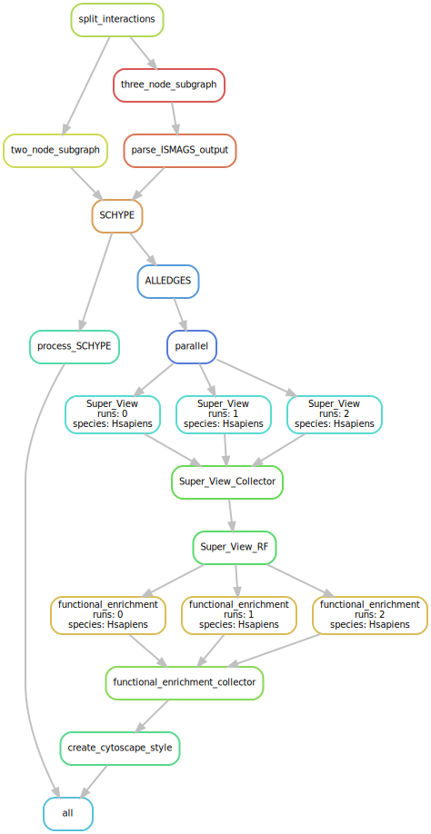

# SUBATOMIC:	SUbgraph BAsed mulTi-OMIcs Clustering
The subgraph based multi-omics clustering (SUBATOMIC) framework is a methodology to integrate, cluster and annotate networks into functional modules.
Interaction networks can be of any interaction type and contain directed or directed edges such as transcription factor-target networks, miRNA-target networks or protein-protein interaction networks as long as they have a common set of shared nodes. 
SUBATOMIC first integrates all networks into one prior network and decomposes it into two- and three-node subgraphs using ISMAGS. The resulting subgraphs are further categorized according to their type (ALL, COM, COR, COP, CIR, FBU, FB2U) and clustered into modules using the hyperedge clustering algorithm SCHype. The resulting modules contain a high density of subgraphs and are further characterized with the functional enrichment method GOATOOLS. Connections in between modules as well as between modules and regulators are statistically investigated to preserve the larger network context. Static modules can be further integrated with condition-specific expression data to study dynamic modules.





## How to run SUBATOMIC: Toy example
We created a small toy example for *H. sapiens* that can computationally be run more efficiently.

### Dependencies
Make sure all dependencies are installed and ready to use. The version number of
python packages should be seen as recommendations, since the pipeline might also 
work with slightly different versions.  

- Python >3.6  
  - numpy 1.20.2  
   - pandas 1.2.4  
   - itertools   
   - subprocess  
   - re  
   - shutil  
   - GOATOOLS 1.0.15  
- Snakemake 6.1.2   
- R > 4.0.0  
   - igraph   

### Installation and start
Clone the repository and adapt the config file.  
The pipeline can be started calling:  
```snakemake -s Integrated_Pipeline --configfile config_test_hsapiens_toyNet.yaml --cores 3```

### Required and optional input files
Shows an overview of the files required for the analysis. Except for go-basic.obo, all file names can be freely chosen but have to be set in the config file. All files listed below are contained in the example folder. 

1. ```go-basic.obo```  

- Required for functional enrichment with GOATOOLS  
- Located in the base folder next to 'Integrated_Pipeline'
- Latest version can be obtained from [GENEONTOLOGY](http://geneontology.org/docs/download-ontology/)
2. ```Hsapiens_goa_ensembl.gaf```  

- Required for functional enrichment with GOATOOLS  
- Latest version can be obtained from [GENEONTOLOGY_annotations](http://geneontology.org/docs/download-go-annotations/)
- Need to match the identifiers of the input network (already done for the toy example)

3. ```Hsapens_subgraphs.csv```  

- Plane list of all subgraphs without header
- Due to symmetric reasons, some subgraphs can be redundant. From a set of equivalent subgraphs, only one should be kept
- List can be self defined or generated using the utility script generate_motif_list.py that gives a non-redundant list of motifs given the network letters

4. ```Hsapiens_goa_ensembl.gaf```  

- File containing all edges from the integrated prior network
- No header, content:
  - First column contains node_1 (in case of directed interactions - the regulators)
  - Second column contains node_2 (in case of directed interactions - the targets)
  - Third column contains the letter representing the network to which this interaction belongs
- Networks can only contain **either** directed **or** undirected edges, but no mix of both

5. ```Hsapiens_background_genes_ensembl.csv```

- Optional, no header, plane list of identifier used as background for functional enrichment analysis
- Here: a large number of protein coding genes in *H. sapiens*

6. ```Hsapiens_functional_description.csv```

- File containing a mapping of identifiers to gene names as well as an optional short description of the gene function
- Header, content:
  - First column: Primary identifier, which is also used in the interaction file
  - Second column: External gene name
  - Third column: Potential alternative identifier or gene name
  - Fourth column: Functional description

7. ```Hsapiens_miRNAs.csv```

- Plane file containing the identifiers of all miRNAs
- Used in the superview analysis

8. ```Hsapiens_TFs.csv```

- Plane file containing the identifiers of all transcription factors
- Used in the superview analysis

### Configuration file
 
Check the config file ```config_test_hsapiens_toyNet.yaml```.  
For the toy example, settings are already done.  

- Set all path variables:  
  - **interaction**: *string*,  path + filename to interaction file
  - **subgraph_type**: *string*, path + filename to file containing all subgraphs to be investigated
  - **Functional_Description**: *string*: path + filename to functional description file
  - **Transcription_Factors**: *string*,  path + filename to list of TF
  - **GO_ASSOCIATIONS**: *string*, path + filename to GO annotation file
  - **scripts**: *string*, path to script folder
  - **output_folder_name**: *string*, any name for an analysis run
  - **directed_interactions**, *list*, letters indicating networks containing exclusively directed_interactions
  - **undirected_interactions**, *list*, letters indicating networks containing exclusively undirected_interactions
  - **miRNA_interactions**: *list*, letters indicating the network containing miRNA-target interactions
  - **homolog_interactions**: *list*, letters indicating networks containing undirected homologous interactions  
  - **modules**: *list*, choice from "ALL", "COR", "COP", "CIR", "FBU", "FB2U" and "FFL" - specifies the modules included in the analysis
  - **schype_edge_weigt**: *int*, weight parameter for SCHYPE - higher values than 1 give more emphasis to the edges in the node-to-edge ratio
  - **goatools_pvalue**: *float*, threshold p-value for gene enrichment analysis
  -  **call_R**: *string*, command how to call R from the command line (e.g. R)
  -  **cores**: *int*, number of cores used for the parallelization of superview. Careful: cores have to be submitted again calling snakemake with --cores. The number of cores specified here needs to be <= the number of --cores.
  - **annotation_background**: *string*, choice that should be taken as background for the functional enrichment analysis. Three options are available:
      - path + name to a list of gene identifiers that will serve as background
      - "ModuleType": all genes of a module type e.g. all genes contained in all CIR modules
      - "ALL": all genes in the input network
  - **superview_background**: *string*, choice that should be taken as background distribution for the suberview z-score calculation. Two options are available:
    - "network": all interactions of a network type e.g. H -- RECOMMENDED 
    - "module": all interactions of a network type within a specific type of module e.g. H in CIR 
    
### Running the toy example 
Even though the prior network published in the paper is far from complete, calculation takes a significant amount of time.
For testing purposes we created a smaller network (toy_Net). We selected up to k modules from the SUBATOMIC run  based on the full network and 
re-created an interaction file containing only genes involved in this modules (for k=5). This toy net can then be used to 
test the pipeline using only a  small amount of time. However, we also provide the ```Hsapiens_interaction_file.csv``` containing the network used in the publication. **Important:** The implementation of GOATOOLS is very greedy for space, thus when annotating even a few modules with 3 cores as done in this example,  the RAM demand can go > 32 GB. 
1. Clone the repository 
2. Go to the base folder and unzip the go-basic.obo file with  
```tar -xzf go-basic.obo.tar.gz``` 
3. Go to example_data/Hsapiens_M1/ and unzip the GAF file with
```tar -xzf Hsapiens_goa_ensembl.gaf.tar.gz```
4. Adapt the config file. For this example, all parameters are set and the example is run on 3 cores
5. Go to the SUBATOMIC folder and run
```snakemake -s Integrated_Pipeline --configfile config_test_hsapiens_toyNet.yaml --cores 3```
In case you want to rerun the entire pipeline, you need to delete the ```Logs``` 
file in the run folder as well as the hidden .snakemake folder 
6. Investigate the results

 - All output results can be found in the folder specified in the config file
 - A list and short description of the most important output files can be found
 in the following section 

7. Visualization with Cytoscpae

- Start Cytoscape
- Open the folder ```/data/human_network/final_networks/Hsapiens/MotifClusters/SCHYPE/SCHype*/```
- The network is contained in the ```edges.nnf file```. Open this file  in Cytoscape (e.g. drag and drop it to the network file area)
- The annotation for this network is included in ```NodeAttributes.noa```.  Open this file  in Cytoscape (e.g. drag and drop it to the table files section)
- The Cytoscape style is included in the folder ```Cytoscape``` and called ```cytoscape_style.xml```. Import the style sheet by opening the ```File``` tab, ```Import``` and ```Styles from File```. This has to be done only once for each combination of directed and undirected network letters.
- Select all networks, right-click on ```Apply Style``` and select the imported style. Under the tab Style and Labels, it is possible to change the IDs to gene names. 
- Hint: Cytoscape sometimes introduces errors while importing by renaming all listed modules two indices higher (e.g. COR_2 instead of COR_0). In the node table view however, the correct naming is shown. Moreover it is  recommended to only load smaller selections of modules at a time to not overload Cytoscape.

8. Contextualization

- It is possible to contextualize the data with the hypoxia dataset 
- For visualization of module expression, open the R script ```VisualizeHypoxia.R```
in the ```utility_scripts``` folder and adapt the working directory in line 11 to the location of the SUBATOMIC repository
- The path to input and output files should be set already for running the hypoxia data visualization as described in the paper
- Visualizations are saved at the location ```Hsapiens/contextualization_hypoxia/```
- Next, one can use the ```calculate_contextualization_scores.py``` script to calculate nPCC, ECD and activity scores
- To calculate values for this example, go to the SUBATOMIC folder and call: 
```python utility_scripts/calculate_contextualization_scores.py -expression example_data/hypoxia/GSE53012_expression.tsv -out Hsapiens/contextualization_scores/ -activity -ECD -nPCC -clusters Hsapiens/SCHYPE/ -sampling_k 20 -pvalues example_data/hypoxia/hypoxia_p-values_PC_3_mapped.csv -meta example_data/hypoxia/hypoxia_ECD_meta.csv```


### Important output files
All results are stored in the designated output folder specified in the description. 
In the following, we describe the content of all folders. However, most files are intermediate files. We therefore provide a list of the most 
important result files that come handy while exploring in depth the generated modules:

- ```Cytoscape/cytoscape_style.xml```
- ```GOATOOLS/Enrichment_Modules.csv```
- ```MotifClusters/SCHYPE/SCHype{module_name}/cluster.cla```
- ```MotifClusters/SCHYPE/SCHype{module_name}/edges.nnf```
- ```MotifClusters/SCHYPE/SCHype{module_name}/NodeAttributes.noa```
- ```MotifClusters/Superview/{module type}.csv```
- ```MotifClusters/Superview/miRNA.csv```
- ```MotifClusters/Superview/RF.csv```
- ```MotifClusters/Superview/Module_RF_stats.csv```
- ```MotifClusters/Superview/TF_miRNA_target_stats.csv```

### Overview of all generated output files
A more detailed list of all files can be found here:  
  
1. ```2nodemotifs```  

- Folder
- List of two node motifs found
- Columns:
  - First node
  - Second node
  - Type
- Calculated for DD2 (two self-pointing directed interactions)
- Calculated for DU2 (two self-pointing interactions, one directed, one undirected)

2. ```3nodemotifs```  

- Folder
- Contains the preprocessed output of ISMAGS for each motif that was searched for
- First line indicates number of motifs found

3. ```Cytoscape```

- Folder
- Contains the 'cytoscape_style.xml', which is an importable style in Cytoscape
- File is created based on the set of undirected and directed nework letters
- Edge colors per network letter can also be changed in this file

4. ```GOATOOLS```

- Folder
- Contains a subfolder per module
- Each subfolder contains intermediate results from the parallelized functional enrichment analysis
- Important files 
  - ```Enrichment_Modules.csv```
  - Contains all significant functional enrichments per module
  - Columns
    - **group**: module type
    - **module_no**: module number
    - **p-value-rank**: per module, what is the term with lowest p-value, second lowest p-value ...
    - **log2foldRatio**: log2 of fold change to indicate strength of enrichment
    - **Remaining**: all remaining columns are default output of GOATOOLS
    
5. ```goatools-main```

- Folder
- Intermediate results for functional enrichment
- Not relevant for final result

6. ```Interactions```

- Folder
- Contains a file for each network type:  ```{output_folder_name}_{network letter}_{d|u}.txt```
- Formatted network files used as input for ISMAGS subgraph search

7. ```MotifClusters```

- Folder
- Subfolder ```ModuleViewer``` 
- Subfolder ```SCHYPE``` contains the clustered modules and related information split up for each module type ```SCHype{module_name}```
  - ```cluster.cla```
  - Summary information per cluster
  - Columns
    - **Cluster**: name of the module
    - **NrEdges**: number of edges contained in cluster
    - **PerHOM**: percentage of homologous edges
  -  ```cluster.eda```
  - Assigns each interaction to a cluster
  - Columns
    - First node (e.g. TF)
    - Type of interaction (e.g. R)
    - Second node (e.g. target gene)
    - Assigned cluster
  - ```ClusteringCoefficient.txt```
  - Information about the clustering coefficient per module. A value of 1 indicates a fully connected graph.
  - Columns
    - Module name
    - Clustering coefficient
  - ```Data_ALL.txt```
  - Summarizes some more general information per cluster 
  - Columns
    - **Module**: name of the module
    - **Comments**: annotated comments if they exist
    - **nrTF**: number of TFs in the module
    - **nrGO**: number of GO annotated terms in the module
    - **nrInCluster**: number of genes in the cluster
  - ```edges.nnf```
    - Network file for import into Cytoscape
  - ```edges.sif```
    - Simple interaction format showing edges and the edge type as extra information
    - Columns
      - Source node
      - Interaction type 
      - Target node
  - ```NodeAttributes.noa```
  - Attribute file that can be imported into Cytoscape to annotate modules
  - Information is based on the ```functional_description.csv``` input file
  Columns
    - **Accession_Number**: Gene ID
    - **FuncName**: Name of the gene
    - **Type**: TF, miRNA or gene
    - **TF_type**: family or type of transcription factor
    - **Has_GO**: information whether the gene is annotated with GO-terms
    

8. ```parallel```

- Folder
- Internal folder containing a split of modules into bins for parallelization
- Not relevant as result


9. ```SCHYPE```

- Folder
- Contains the primary output of SCHYpe clustering and some intermediate files
- Subfolder ```SCHYPE``` contains the clustered modules and related information split up for each module type ```SCHype{module_name}```
  - ```ALLEDGES.txt```
  -  Contains all egdes and their association to a module
    - Columns
      - Number of modules
      - Source node
      - Edge type, letter indicates interaction type, upper and lower case indicate edge directions
      - Target node
  - ```*.edges.txt```
  - Contain all three node motifs
  - Columns
    - Module number
    - First node
    - Second node
    - Third node
  - ```*.nodes.txt```
    - List for each node to which module it belongs
    - Columns
      - Node
      - Module number
  - ```Motifs.txt```
    - List of subgraphs included in all modules of a certain type
    - Columns
      - First node
      - Second node
      - Third node
  - ```MotifsType.txt```
    - List of subgraphs and their subgraph type
    - Columns
      - First node
      - Second node
      - Third node
      - Motif type
      
10. ```Superview```

- Folder
- Contains the result of the superview analysis
- ```{module type}.csv```
  - Contain all pairs of modules and their interactions
  - Columns
    - **module1**: module type of first module in comparison
    - **module1_nr**: module number of first module in comparison
    - **module1_size**: module size of first module in comparison
    - **module2**: module type of second module in comparison
    - **module2_nr**: module number of second module in comparison
    - **module2_size**: module size of second module in comparison  
    - **{Network_letter}_count**: number of interactions between modules originating from a certain network
    - **{Network_letter}_z-score**: z-score against a comparison of 1000 random modules of the same size 
    - **{Network_letter}_pvalue**: 1-CDF of z-score
  - ```miRNA.csv and RF.csv```
  - Summary file of interactions between each regulator and target module
  - Columns
    - **Group**: either miRNA or RF (Regulatory Factor e.g. transcription factor)
    - **regulator_name**: identifier of regulator
    - **module2**: module type of  module in comparison
    - **module2_nr**: module number of  module in comparison
    - **module1_size**: module size of  module in comparison
    - **{Network_letter}_count**: number of interactions between RF and module originating from a certain network
    - **{Network_letter}_fraction**: fraction of nodes in the module targeted by a regulator of from a certain network
    - **SumCount**: all counts over all network types
    - **fraction**: fraction of nodes in the module targeted by a regulator     
  - ```Module_RF_stats.csv```
  - Overview per module to summarize how many regulators target this module
  - Columns
    - **Module**: module name
    - **count_RF**: count how many TF target a module
    - **total_RF**: count how many TF were included in the prior network
    - **percentage_RF**: percentage how many RF are targeting a module
    - **count_miRNA**: count how many miRNA target a module
    - **total_miRNA**: count how many miRNA were included in the prior network
    - **percentage_miRNA**: percentage how many RF are targeting a module
  - ```TF_miRNA_target_stats.csv```
  - Overview per module to summarize how many modules are targeted by a specific regulator
  - Columns
    - **RF**: ID of the regulator
    - **type**: type of regulator, either TF or miRNA
    - **count**: number of targeted modules
    - **total**: total number of modules
    - **percentage**: percentage of modules covered compared to the total number of modules      

### Input, output and arguments to calculate contextualization scores
The contextualization script can be run for all three analyses together or
separately.

- Call
  - ```python utility_scripts/calculate_contextualization_scores.py [options and flags]```
- Possible flags
  - ```-expression```: set path and name of file containing expression data
  - ```-pvalues```: set path and name of file containing deferentially expressed p-values
  - ```-meta```: set path and name of file containing meta data for ECD scores
  - ```-clusters```: set path to the SCHYPE output folder (containing SCHypeALL, SCHypeCIR etc.)
  - ```-out```: set path were to store the results
  - ```-nPCC```: Flag that enables nPCC calculation. No argument needed
  - ```-ECD```: Flag that enables ECD calculation. No argument needed
  - ```-activity```: Flag that enables module activity calculation. No argument needed  
  - ```-sampling_k```: Integer value indicating the iterations for random sampling
  
- Input files
  - ```expression file```
    - Contains the expression data on which the script should be run
    - Columns: samples
    - Rows: genes
    - Separator: tab
  - ```p-value file```
    - Contains p-values per gene in the expression file. Missing p-values are considered as 1
    - Header: True
    - First column: gene identifier 
    - Second column: p-value
  - ```clusters```    
    - Modules as produced by the SUBATOMIC pipeline
  - ```-meta```
    - Contains meta information about the experiment 
    - Header: True
    - First column: Sample header in the expression file
    - Second column: Experiment identifier if multiple experiments should be tested. Each experiment is processed individually
    - Third column: Names or identifier of different experimental conditions. Needs to include control conditions. At least three control and three condition samples need to be provided
    - Fifth column: A 0 or 1 indicator to mark control conditions (with a 1)
- Output files
  - ```ECD.csv```
    - **module**: name of module
    - **experiment**: number of experiment
    - **condition**: name of condition
    - **length_module**: number of nodes in the module
    - **mean_dPCC**: mean differential Pearson correlation in the module between control and conditions
- Required flags per analyses
  - Calculate ECD score
    - ```-clusters```
    - ```-expression```
    - ```-sampling_k```
    - ```-meta```
  - Calculate nPCC
    - ```-clusters```
    - ```-expression```
    - ```-sampling_k``` 
  - Calculate module activity
    - ```-clusters```
    - ```-pvalues```
    - ```-sampling_k```     
